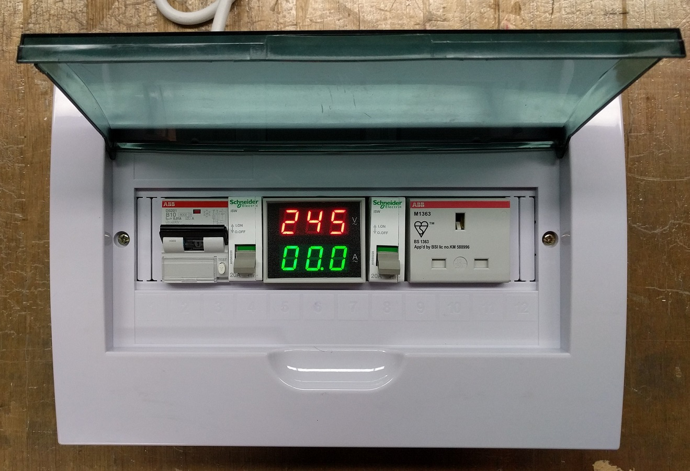
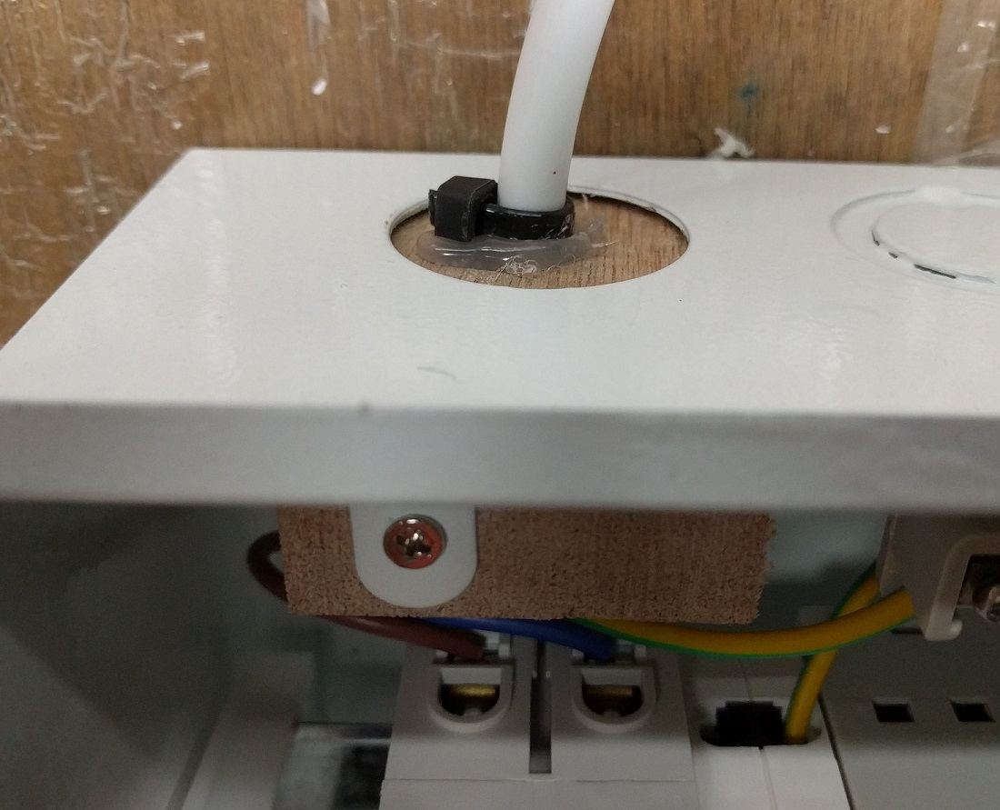
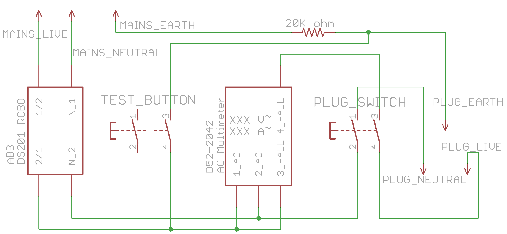
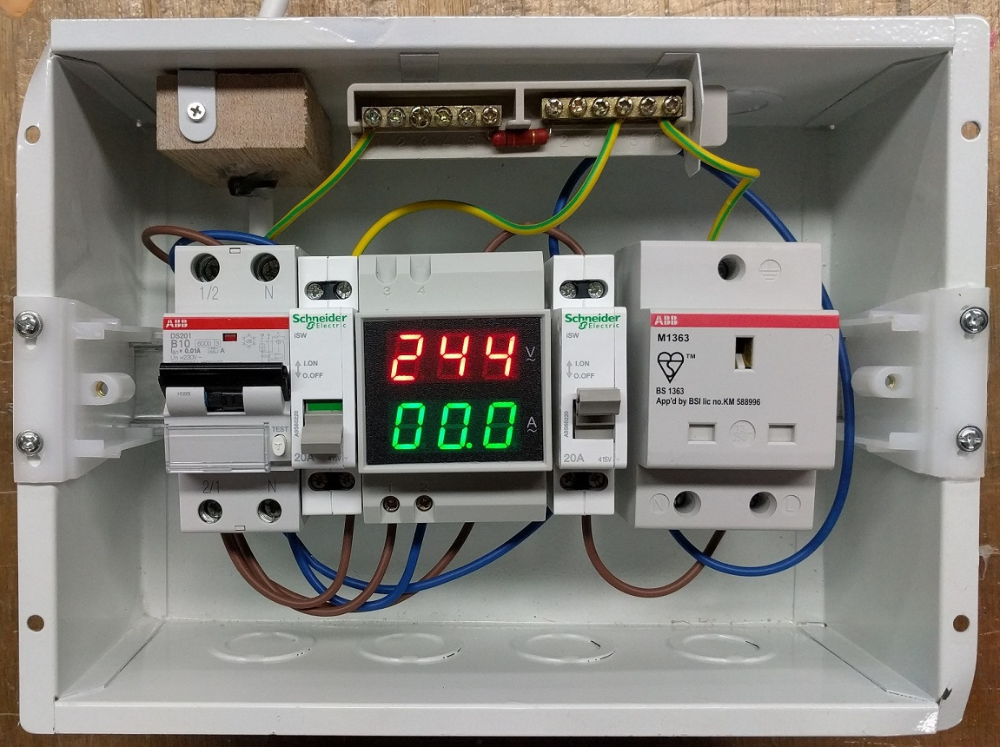

# 10ma-rcbo-and-anti-external-cb-trip

This is a combination of the [10mA RCBO](../10ma-rcbo) and the [trip-10ma-rccb-only-tool](../trip-10ma-rccb-only-tool/).

##Demo video on Youtube

##Photos

##Usage instructions

1) Do NOT set up without prior training.  
2) Always test before use.   
  a. Only the 10mA RCCB should trip  
  b. If it does not, there may be a problem with the external Earth connection or with this tool. Do not continue to use.
3) All other RK electrical connections will be connected through this.

##Design

Electrical schematic in Eagle format.

##Parts
1. [ABB DS201, 10mA, 1+N, 10A, Type B RCBO](https://sg.rs-online.com/web/p/rcbos/7674049/) 
2. [2x Schneider Electric 2 Pole DIN Rail Mount Non-Fused Switch Disconnector, 2NO, 20 A, IP40](https://sg.rs-online.com/web/p/non-fused-switch-disconnectors/7907434/)
3. [ABB 1 Gang Unswitched Electrical Socket, Type G - British, 13A, DIN Rail Mount, IP20, IP30](https://sg.rs-online.com/web/p/electrical-sockets/8294571/)
4. [AC Multimeter D52-2042](http://www.aliexpress.com/item/DIN-RAIL-Dual-led-display-Red-green-AC80-300V-AC0-1-99-9A-Digital-voltmeter-ammeter/32304010220.html)
5. [ Mounted Plastic 12 Ways Distribution Box for circuit breaker](http://www.aliexpress.com/item/Conceal-Mounted-Plastic-6-Way-Distribution-Box-Lighting-Box-suit-for-home-Hotel-Office/32327993352.html)
6. [20k ohm, 3W, 5% throughhole resistor](http://sg.element14.com/vishay-bc-components/pr03000202002jac00/metal-film-resistor-20-kohm-3/dp/1755172)
