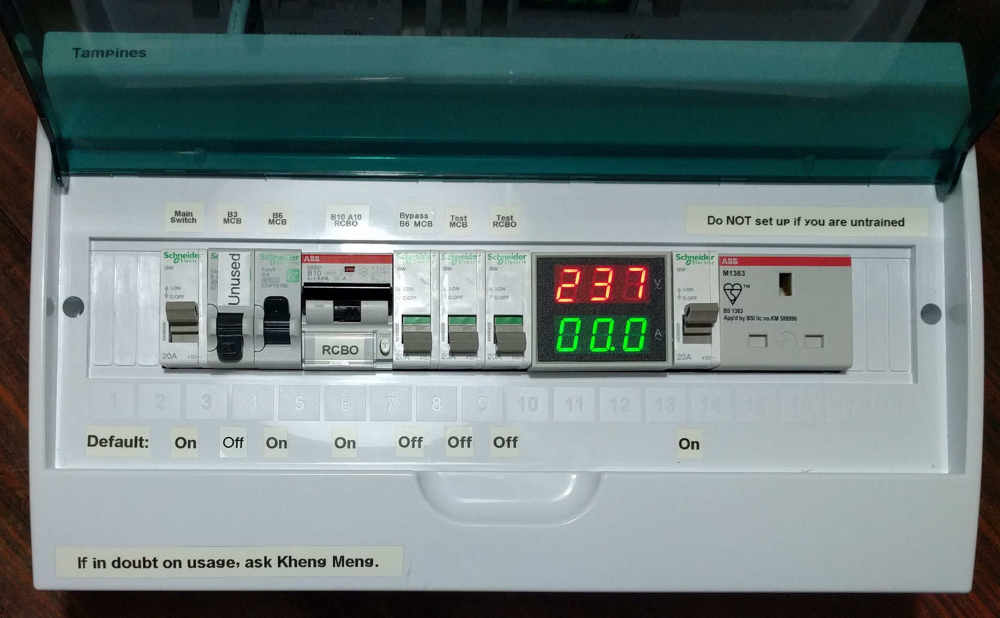
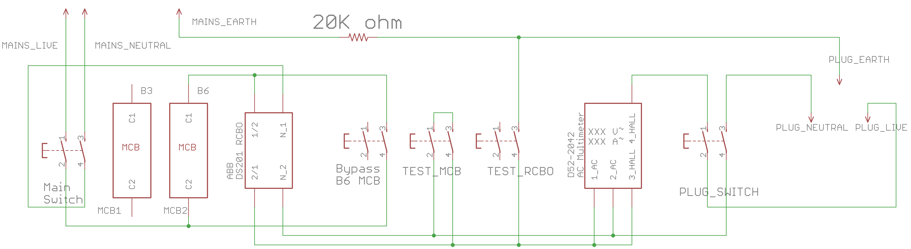
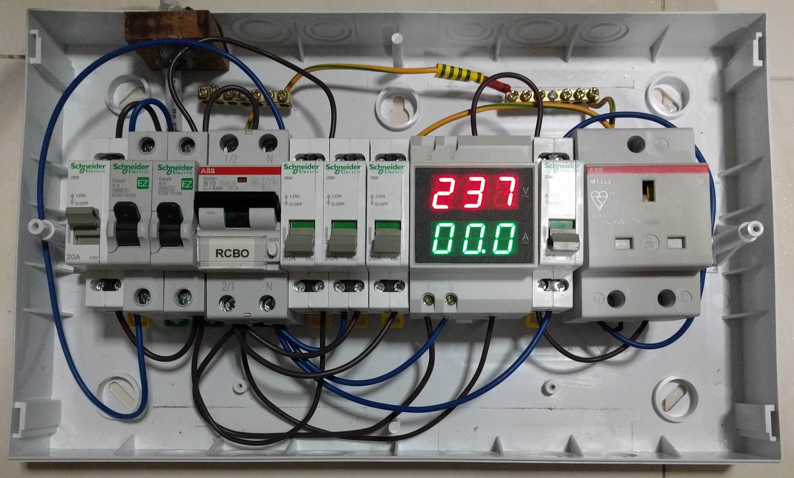

# 10ma-rcbo-mcb-and-anti-external-cb-trip

This is an improvement of the [10ma-rcbo-and-anti-external-cb-trip](../10ma-rcbo-and-anti-external-cb-trip/) with 2 extra MCBs. As of September 2016, I have dropped the use of the B3 MCB as it is too sensitive for typical use. It is left unconnected in the box.

##Photos

##Usage instructions
1. Do NOT set up without prior training.
2. Always test RCBO before use. 
  a. Only the 10mA RCCB should trip.
  b. If it does not, there may be a problem with the external Earth connection or with this tool. Do not continue to use.
3. Only test MCB if you are ready for a trip of your onsite MCB.
4. All other RK electrical connections will be connected through this.
5. If the “B6 MCB” keeps tripping due to high-current appliance, you can temporarily engage the “Bypass B6 MCB” switch.

##Design

Electrical schematic in Eagle format.

##Parts
1. [ABB DS201, 10mA, 1+N, 10A, Type B RCBO](https://sg.rs-online.com/web/p/rcbos/7674049/) 
2. [5x Schneider Electric 2 Pole DIN Rail Mount Non-Fused Switch Disconnector, 2NO, 20 A, IP40](https://sg.rs-online.com/web/p/non-fused-switch-disconnectors/7907434/)
3. [ABB 1 Gang Unswitched Electrical Socket, Type G - British, 13A, DIN Rail Mount, IP20, IP30](https://sg.rs-online.com/web/p/electrical-sockets/8294571/)
4. [AC Multimeter D52-2042](http://www.aliexpress.com/item/DIN-RAIL-Dual-led-display-Red-green-AC80-300V-AC0-1-99-9A-Digital-voltmeter-ammeter/32304010220.html)
5. [ Mounted Plastic 14-18 Ways Distribution Box for circuit breaker](http://www.aliexpress.com/item/14-18-ways-Plastic-distribution-box-for-circuit-breaker-indoor-on-the-wall/32276160760.html)
6. [20k ohm, 3W, 5% throughhole resistor](http://sg.element14.com/vishay-bc-components/pr03000202002jac00/metal-film-resistor-20-kohm-3/dp/1755172)
7. [Schneider Electric 3A 1 Pole Type B MCB Easy 9 Easy9](http://sg.rs-online.com/web/p/residential-mcbs/8508596/)
8. [Schneider Electric 6A 1 Pole Type B MCB Easy 9 Easy9](http://sg.rs-online.com/web/p/residential-mcbs/8508599/)
