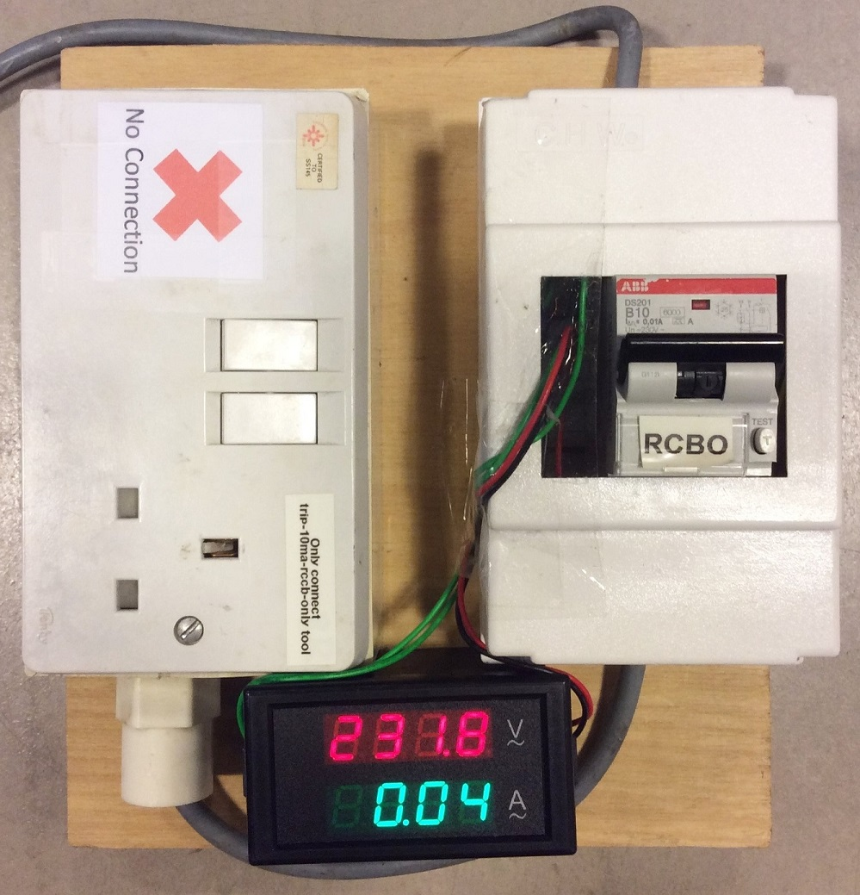
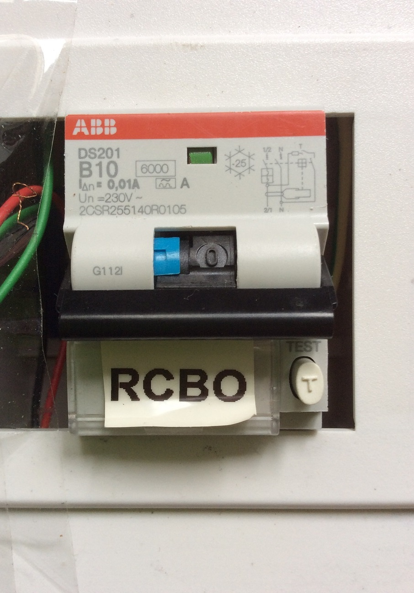
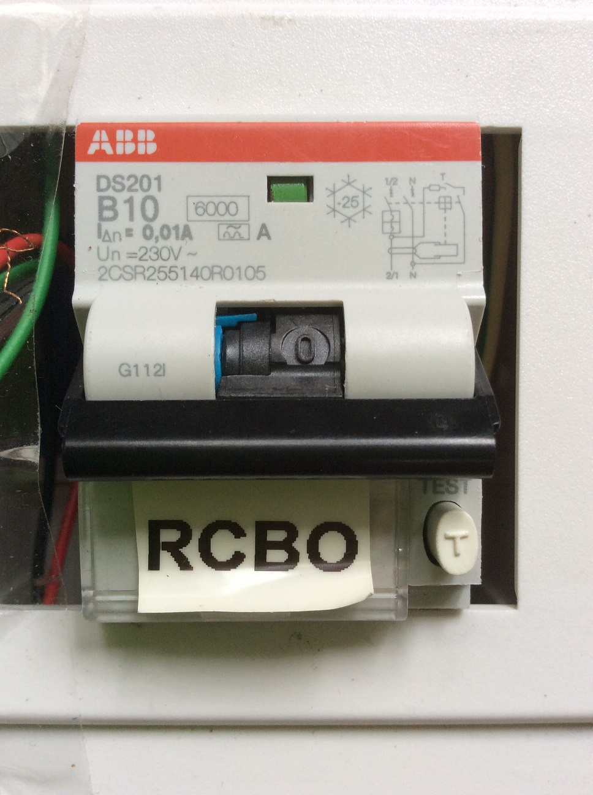

# 10mA RCBO

A more sensitive 10ma residual-current circuit breaker with overcurrent protection (RCBO) compared to conventional 30mA earth-leakage breakers. An AC voltmeter and ammeter (using hall-effect sensor) is also onboard.

## Demo video on Youtube

## Photos

One of the LCD cells is faulty..

Earth trip. Switch and blue tab is down.

Overload trip. Only the switch is down.

## Parts
1. [ABB DS201, 10mA, 1+N, 10A, Type B RCBO](https://sg.rs-online.com/web/p/rcbos/7674049/)
2. [AC voltmeter and ammeter](http://www.aliexpress.com/item/AC-Digital-Ammeter-Voltmeter-Dual-Digital-LCD-Panel-Amp-Volt-Current-Meter-100A-80-300V-w/32264125864.html)
3. DIN rail mount
4. Dual 3-pin sockets
