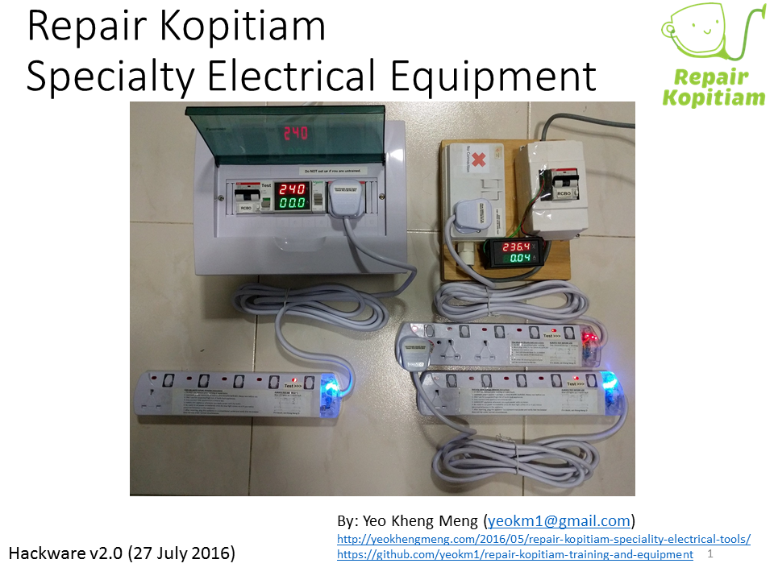
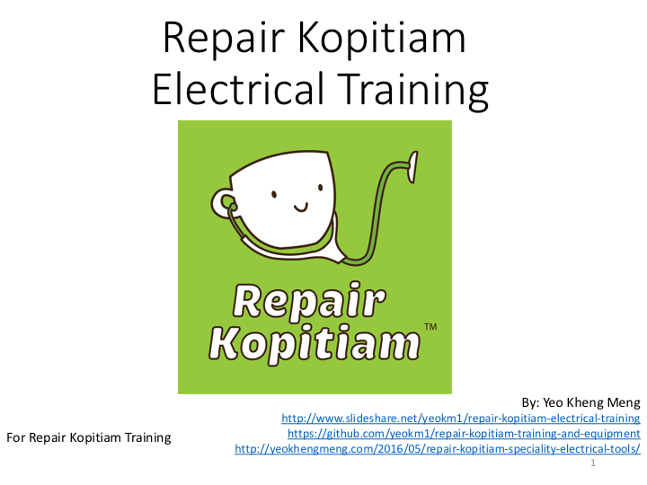

# repair-kopitiam-training-and-equipment
Training materials and equipment schematics for Repair Kopitiam.

##Hackware talk

I gave a talk about these equipment at [Hackware v2.0](https://www.facebook.com/events/481593632030061/) on 27 July 2016. Here are the slides.

Here is the video

##Training materials

Files of the slides and simulation material are found in the [training directory](training). Slides can be viewed using the picture link below.

##Equipment

An oveview of all the specialty equipment.

Click for higher resolution version.

This repository so far contains only 5 pieces of equipment. More details can be found in the subdirectories.

1. [10mA RCBO](10ma-rcbo)
2. [trip-10ma-rccb-only-tool](trip-10ma-rccb-only-tool)
3. [anti-trip-earth-leakage-detector](anti-trip-earth-leakage-detector)
4. [10ma-rcbo-and-anti-external-cb-trip](10ma-rcbo-and-anti-external-cb-trip)
5. [10ma-rcbo-mcb-and-anti-external-cb-trip](10ma-rcbo-mcb-and-anti-external-cb-trip)
