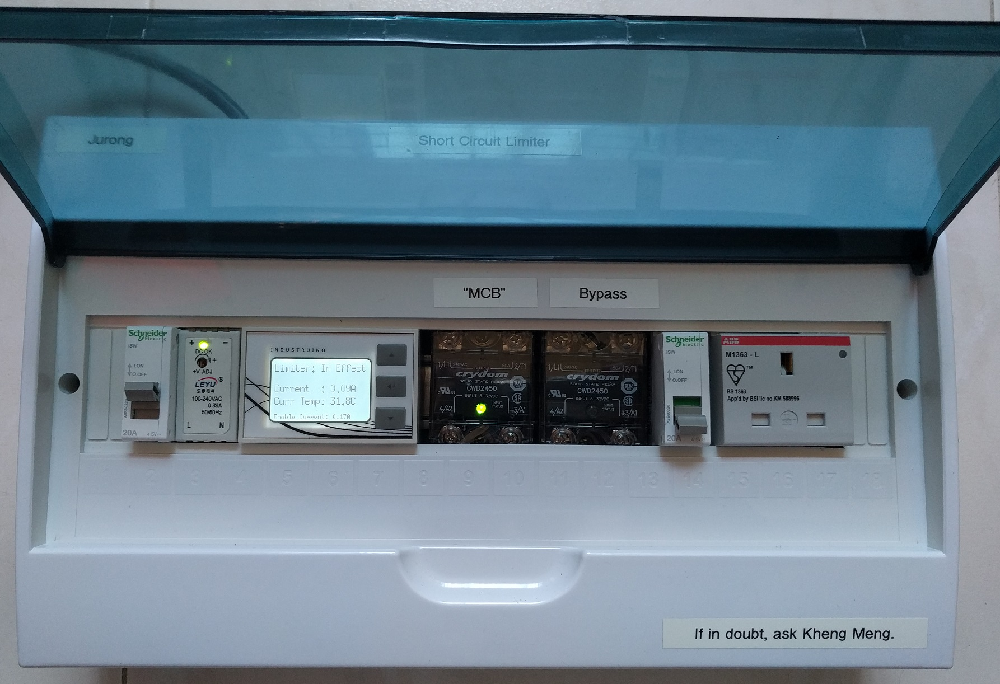
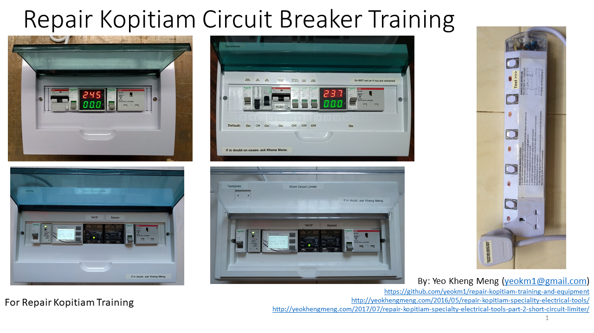

# repair-kopitiam-training-and-equipment
Training materials and equipment schematics for Repair Kopitiam. Detailed blog posts behind this can be found here: [Part 1](http://yeokhengmeng.com/2016/05/repair-kopitiam-speciality-electrical-tools/) and [Part 2](http://yeokhengmeng.com/2017/07/repair-kopitiam-specialty-electrical-tools-part-2-short-circuit-limiter/).

Some of the equipment in this picture have been deprecated. See the listing below for details.

This repository so far contains 6 pieces of equipment. More details can be found in the subdirectories.

1. [10mA RCBO](10ma-rcbo) (Deprecated)
2. [trip-10ma-rccb-only-tool](trip-10ma-rccb-only-tool) (Deprecated)
3. [anti-trip-earth-leakage-detector](anti-trip-earth-leakage-detector)
4. [10ma-rcbo-and-anti-external-cb-trip](10ma-rcbo-and-anti-external-cb-trip)
5. [10ma-rcbo-mcb-and-anti-external-cb-trip](10ma-rcbo-mcb-and-anti-external-cb-trip) (In use but overkill)
6. [short-circuit-limiter](short-circuit-limiter)

## Hackware talks

1. Part 1 at [Hackware v2.0](https://www.facebook.com/events/481593632030061/) on 27 July 2016: [Slides](http://www.slideshare.net/yeokm1/repair-kopitiam-specialty-electrical-equipment) and [Video](http://www.youtube.com/watch?v=OkuFtGhXB7U) about Equipment 1-4.

2. Part 2 at [Hackware v3.4](https://www.facebook.com/events/261629434317053/) on 6 Sept 2017: [Slides](https://www.slideshare.net/yeokm1/repair-kopitiam-specialty-tools-part-2-short-circuit-limiter) about the short-circuit-limiter.

## Training materials

Files of the slides and simulation material are found in the [training directory](training). Slides can be viewed using the picture link below.

