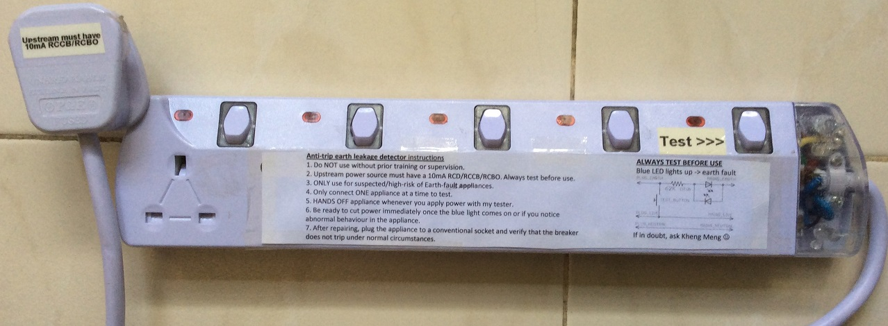
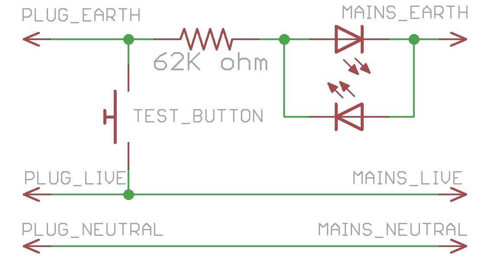
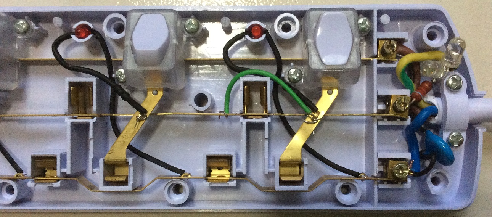

# anti-trip-earth-leakage-detector

Tool to prevent circuit breaker trips on both 10mA and 30mA residual current breakers when encountering appliances with earth leakage. An LED indicator will display when an earth leak is detected. This tool should be used in conjunction with the [10mA RCBO](../10ma-rcbo) connected somewhere upstream.

## Demo video on Youtube

## Photo

## Usage instructions

1. Do NOT use without prior training or supervision.
2. Upstream power source must have a 10mA RCD/RCCB/RCBO. Always test before use.
3. ONLY use for suspected/high-risk of Earth-fault appliances.
4. Only connect ONE appliance at a time to test.
5. HANDS OFF appliance whenever you apply power with my tester.
6. Be ready to cut power immediately once the blue light comes on or if you notice abnormal behaviour in the appliance.
7. After repairing, plug the appliance to a conventional socket and verify that the breaker does not trip under normal circumstances.

## Design

Electrical schematic in Eagle format. I put 2 LEDS in opposite directions to ensure that the AC current can still flow throughout all phases.

The rightmost button has been converted to a test button where the socket live is connected to the earth line by a green wire to simulate a faulty appliance. If pressed, the blue LEDS should light up with no trip on either the 10mA or 30mA RCCB/RCBO.

## Parts
1. Any power strip with a translucent area so the LEDs are visible.
2. [62k ohm, 2W, 5% throughhole resistor](http://sg.element14.com/vishay-bc-components/pr02000206202jr500/metal-film-resistor-62-kohm-2/dp/3173483)
3. [2x blue 5mm LEDS, 20mA, 6000mcd](http://sg.element14.com/multicomp/mcl053ublc-2z-2-8/led-5mm-blue-600mcd-470nm/dp/2365811)
