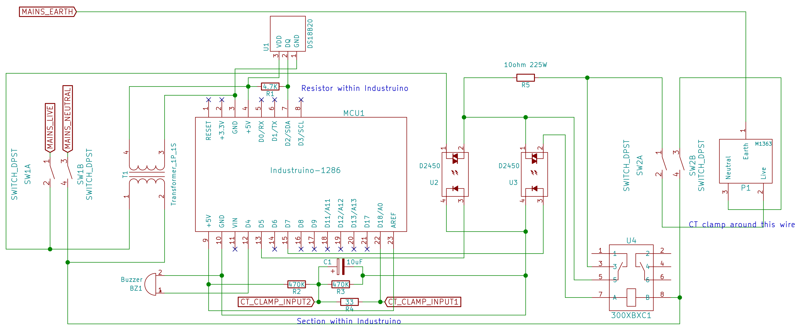

# short-circuit-limiter

This short circuit limiter is to prevent short circuits from causing trips to the external MCB. I've written a [detailed blog post](http://yeokhengmeng.com/2017/07/repair-kopitiam-specialty-electrical-tools-part-2-short-circuit-limiter/) on this device.

# How it works? (High-level)

There is a 10ohm resistor which the initial power to the appliance must flow through. Once the appliance turns on for ONE second without any issues, the resistor is bypassed so the appliance receives the full electrical power.

If there is a short circuit in this one second window, the resistor holds down the short current to 23A. The microcontroller then cuts power to the output until it is reset.

## Photo and video

  
Typical operation of device

  
Mechanical relay movement

  
Mechanical relay movement

## Usage instructions
1. Do NOT set up without prior training.
2. Connect this downstream to the 10ma RCCB
3. Temperature warning is 70C with maximum 85C
4. Use arrow keys to adjust current enable threshold
5. If in doubt, ask Kheng Meng :)

## Design

Electrical schematic in Kicad format.

## Arduino setup
1. Download and install the latest [Arduino IDE](https://www.arduino.cc/en/Main/Software) which is version 1.8.3 at time of writing.
2. Install the [board definition files](https://github.com/Industruino/Board-definition-files) for the Industruino-1286
3. Install the Arduino libraries: DallasTemperature, OneWire and U8g2.
4. Connect the micro-USB cable.
4. Open `short-circuit-limiter.ino`. Select Industruino-1286, the associated port and hit upload!

## Parts
All the parts used in the build can be found in the [BOM file](schematic/short-circuit-limiter-bom.ods).
