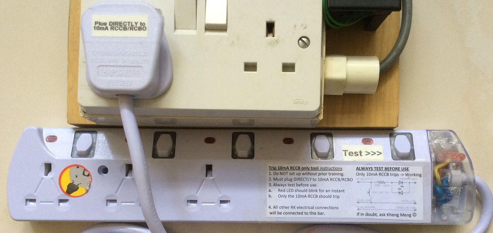
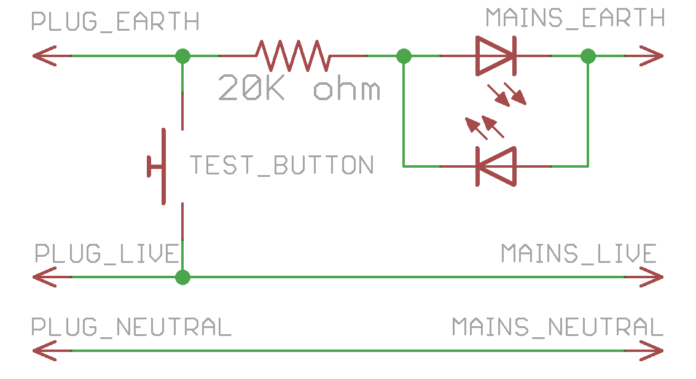
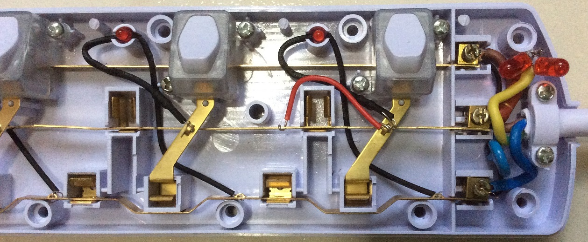

# trip-10ma-rccb-only-tool

Tool to ensure earth-leakage trips only the 10mA earth leakage circuit breaker and not typical 30mA onsite breakers. This tool must be used in conjunction with the [10mA RCBO](../10ma-rcbo).

## Demo video on Youtube

## Photo

## Usage instructions

1) Do NOT set up without prior training.  
2) Must plug DIRECTLY to 10mA RCCB/RCBO  
3) Always test before use.   
a. Red LED should blink for an instant  
b. Only the 10mA RCCB should trip  
4) All other RK electrical connections will be connected to this bar.  

## Design

Electrical schematic in Eagle format. I put 2 LEDS in opposite directions to ensure that the AC current can still flow throughout all phases.

The rightmost button has been converted to a test button where the socket live is connected to the earth line by a red wire to simulate a faulty appliance. If pressed, the red LEDs will blink for an instant and only the 10mA RCCB/RCBO will trip, not the 30mA onsite breaker.

## Parts
1. Any power strip with a translucent area so the LEDs are visible.
2. [20k ohm, 3W, 5% throughhole resistor](http://sg.element14.com/vishay-bc-components/pr03000202002jac00/metal-film-resistor-20-kohm-3/dp/1755172)
3. [2x red 5mm LEDS, 20mA, 400mcd](http://sg.element14.com/multicomp/703-0100/led-5mm-red-400mcd-643nm/dp/2112111)
